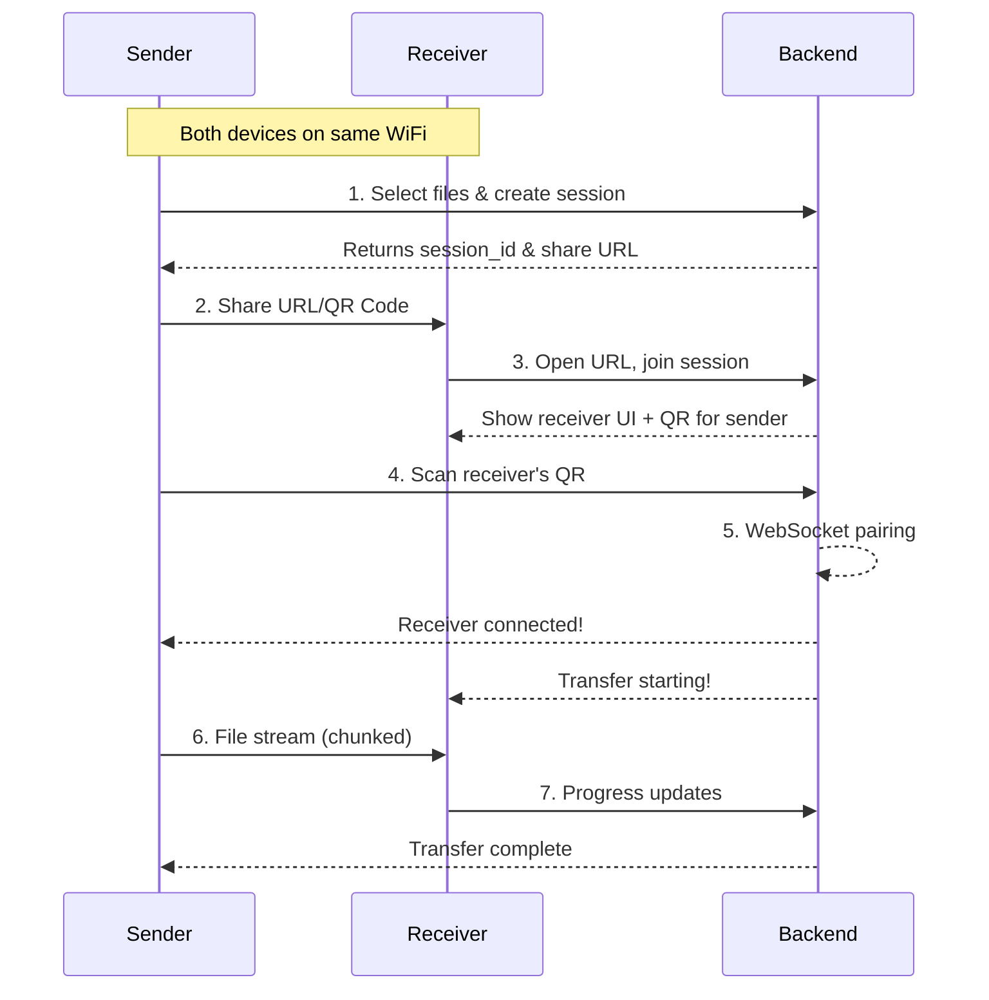

# 📡 MultiShare

<p align="center">
  
  
  
  
</p>

> A fast, secure, and easy way to transfer files between devices on the same local network—no internet connection or account required.

## ✨ Features

| Feature | Description |
|---------|-------------|
| 🔌 **Local Network Only** | All transfers stay on your WiFi—never touch the internet |
| 🚫 **No Accounts** | Start sharing instantly—no login, no registration |
| 📱 **QR Code Sharing** | Scan to connect devices quickly |
| ⚡ **High-Speed Transfer** | Stream files at full LAN speed (50-200 MB/s) |
| 📊 **Live Progress** | Real-time transfer progress with speed display |
| ✅ **Integrity Check** | SHA256 checksum verification |
| 📲 **PWA Support** | Install as a native app on any device |
| 🔒 **Privacy First** | Sessions expire after 1 hour, no logs retained |

## 🔄 How It Works



### Transfer Flow

```
┌─────────────┐     ┌─────────────┐     ┌─────────────┐
│   SENDER    │────►│   SERVER   │────►│  RECEIVER   │
│             │     │  (Flask +  │     │             │
│ 1. Pick     │     │  SocketIO) │     │ 3. Open URL │
│    files    │     │             │     │    & join   │
└─────────────┘     └─────────────┘     └─────────────┘
                           │                   │
                           │ 4. Pair via      │
                           │    WebSocket     │
                           ▼                   ▼
                    ┌─────────────┐     ┌─────────────┐
                    │ 5. Stream   │────►│ 6. Download │
                    │    files    │     │    files   │
                    │ (4MB chunks)│     │ + verify   │
                    └─────────────┘     └─────────────┘
```

## 🚀 Quick Start

### Prerequisites

- Python 3.8+
- A local network (WiFi)

### Installation

```bash
# Clone or download the project
cd MultiShare/backend

# Create virtual environment (recommended)
python -m venv venv
# Windows
venv\Scripts\activate
# Linux/Mac
source venv/bin/activate

# Install dependencies
pip install -r requirements.txt
```

### Run the App

```bash
python app.py
```

Expected output:
```
🚀 MultiShare starting...
📱 Open on sender:   http://192.168.1.5:5000
📥 Receiver visits:  http://192.168.1.5:5000
```

### Usage Guide

1. **Open in Browser** — Visit `http://<your-ip>:5000` on both devices
2. **Send Files** — Click "Send Files", select files, share the link/QR
3. **Receive Files** — Open the shared link or scan QR code
4. **Confirm Transfer** — Review and confirm on the sender side
5. **Download** — Files stream directly to receiver with progress

## 📊 Performance

| Metric | WiFi 5 | WiFi 6 |
|--------|--------|--------|
| Transfer Speed | 50-100 MB/s | 100-200 MB/s |
| Connection Time | < 2s | < 2s |
| RAM Usage | < 100 MB | < 100 MB |

## 🛠️ Tech Stack

```
┌─────────────────────────────────────────────────┐
│                  Frontend                       │
│   HTML5  •  CSS3  •  JavaScript  •  Socket.IO  │
└─────────────────────────────────────────────────┘
                         │
                         ▼
┌─────────────────────────────────────────────────┐
│                   Backend                       │
│   Flask  •  Flask-SocketIO  •  Python 3.8+     │
└─────────────────────────────────────────────────┘
                         │
                         ▼
┌─────────────────────────────────────────────────┐
│              Network Layer                      │
│   HTTP (transfers)  •  WebSocket (signaling)   │
└─────────────────────────────────────────────────┘
```

### Dependencies

- **Flask** — Web framework
- **Flask-SocketIO** — Real-time communication
- **qrcode[pil]** — QR code generation
- **Pillow** — Image processing
- **eventlet** — Async I/O

## 📁 Project Structure

```
MultiShare/
├── backend/
│   ├── app.py              # Main Flask + SocketIO server
│   ├── config.py           # Port, chunk size, session TTL
│   ├── requirements.txt    # Python dependencies
│   └── utils/
│       ├── network.py      # Local IP detection
│       ├── session.py      # In-memory session management
│       └── file_handler.py # Chunked streaming + checksums
│
├── frontend/
│   ├── templates/
│   │   ├── index.html      # Landing page
│   │   ├── send.html       # File sender UI
│   │   └── receive.html    # File receiver UI
│   └── static/
│       ├── css/style.css   # Responsive styles
│       ├── js/main.js      # Client-side logic
│       ├── sw.js           # Service worker (PWA)
│       └── manifest.json   # PWA manifest
│
├── README.md
└── LICENSE
```

## 🔐 Security

- **Local Network Only** — All traffic stays within your LAN
- **Auto-Expiring Sessions** — Sessions expire after 1 hour
- **Random Session IDs** — Unguessable UUIDs prevent unauthorized access
- **Checksum Verification** — SHA256 ensures file integrity
- **No Persistent Storage** — No logs or files retained after transfer

## 🌍 Cross-Platform Support

| Platform | Method |
|----------|--------|
| Windows | Native Python |
| macOS | Built-in Python3 |
| Linux | System Python |
| Android | Termux |
| iOS | Pythonista / a-Shell |

## 📝 License

This project is licensed under the MIT License — see the [LICENSE](LICENSE) file for details.

## 🤝 Contributing

Contributions are welcome! Feel free to open issues or submit pull requests.
